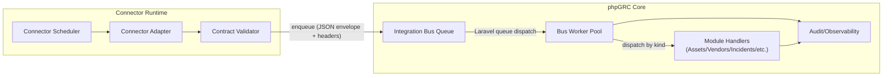

# Integration Bus Developer Guide (Draft)

This guide supplements the Integration Bus contract by showing how connector authors wire jobs into
phpGRC. It includes a high-level architecture view and SDK-style snippets that enforce the contract
found in `integration-bus-envelope.schema.json`. Operational sizing and worker guidance lives in
`docs/ops/INTEGRATION-BUS-QUEUE.md`.

## Architecture Overview



- **Connector Adapter** pulls data from the upstream system and normalizes it to the Bus payload.
- **Contract Validator** enforces the JSON Schema before enqueueing, guaranteeing conformity.
- **Integration Bus Queue** is the shared Laravel queue (`integration-bus`) and DLQ pairing.
- **Bus Worker Pool** fans jobs out based on `kind` and `connectorKey`.
- **Module Handlers** transform payloads into phpGRC tables and emit audit/security events.
- All stages emit structured logs and metrics per the Bus observability requirements.

### End-to-End Message Flow

1. Connector fetches upstream data and maps it to the normalized payload.
2. Contract validator (JSON Schema) runs locally; invalid payloads never reach the queue.
3. Valid envelopes are published to the `integration-bus` queue with required headers.
4. phpGRC workers pick up jobs, verify headers/body, and route to module handlers.
5. Handlers persist data, emit domain events, and clear the `error` field on success.
6. Failures annotate the envelope with an `error` object; repeated failures route to DLQ.

### Connector Registry & Secrets

- `POST /api/integrations/connectors` stores connector configuration with Laravel's encrypted JSON cast so secrets remain at rest. Only callers holding the `integrations.connectors.manage` policy receive decrypted responses.
- `GET /api/integrations/connectors` (and `/api/integrations/connectors/{connector}`) accepts either the connector ULID or slug, enabling SDKs to resolve configuration by friendly key.
- `PATCH /api/integrations/connectors/{connector}` toggles `enabled`, updates metadata, and refreshes health timestamps without re-submitting the entire configuration.
- Refer to `docs/api/openapi.yaml` for full request/response examples and validation rules.

### Observability & Logs

- Every envelope generates an `integration.bus.message.received` audit with connector key, run ID, payload/meta key summaries, provenance, and retry metadata.
- Workers also emit an `integration.bus.message` **structured INFO log** once processing completes. Context includes:
  - `status` (`processed` or `errored`) plus error code/attempt counts when present.
  - Connector metadata (`connector.key`, `connector.version`, `tenant_id`, `run_id`, `priority`).
  - Provenance snapshot (source, externalId, correlationId, replay flag) and attachment summary.
  - The first 15 payload and meta keys to aid debugging without serializing entire payloads.
- Log pipelines can alert on `status=errored` while observability counters live in `integration_connectors.meta.observability`. See `docs/ops/INTEGRATION-BUS-QUEUE.md` for operational runbooks.

### Validation Harness

- Use `php artisan integration-bus:validate <envelope.json> --headers=<headers.json>` to verify sample payloads before shipping connectors.
  - The command loads the JSON envelope, reuses the contract validator, and enforces provenance/header alignment.
  - Required headers (`x-phpgrc-bus-version`, `x-phpgrc-connector`, `x-phpgrc-kind`, `x-phpgrc-run-id`) must match the envelope body; optional correlation headers are checked when supplied.
  - Per-kind payload checks ensure required fields exist (`assetId`, `incidentId`, etc.) and that connector schema references resolve to the expected `$defs` entry in `integration-bus-envelope.schema.json`.
- Integrate the command into CI for connector repositories so pull requests fail when payloads drift from the published contract.

## SDK Snippet — Node/TypeScript

```ts
import { ulid } from "ulid";
import { publishJob, validateAgainstSchema } from "@phpgrc/connectors-sdk";
import schema from "../schemas/integration-bus-envelope.schema.json";

const now = new Date().toISOString();

const job = {
  id: ulid(),
  busVersion: "1.0.0",
  connectorKey: "aws-config",
  connectorVersion: "2025.10.0",
  tenantId: "core.default",
  runId: ulid(),
  kind: "asset.discovery",
  event: "asset.upserted",
  emittedAt: now,
  priority: "normal",
  payload: {
    assetId: "i-0f123456789abcd",
    name: "prod-app-1",
    type: "ec2.instance",
    environment: "production",
    tags: ["tier:web"],
    attributes: {
      account: "123456789012",
      region: "us-east-1"
    }
  },
  provenance: {
    source: "aws-config",
    externalId: "arn:aws:ec2:us-east-1:123456789012:instance/i-0f123456789abcd",
    ingestedAt: now,
    schemaRef: "https://phpgrc.internal/docs/integrations/integration-bus-envelope.schema.json#/$defs/payloadAssetDiscovery"
  },
  meta: {
    collectionWindow: "PT5M"
  },
  error: null
};

validateAgainstSchema(job, schema); // throws on contract violations

await publishJob(job, {
  queue: "integration-bus",
  headers: {
    "x-phpgrc-bus-version": job.busVersion,
    "x-phpgrc-connector": job.connectorKey,
    "x-phpgrc-kind": job.kind,
    "x-phpgrc-run-id": job.runId
  }
});
```

## SDK Snippet — PHP/Laravel Connector

```php
<?php

declare(strict_types=1);

use Illuminate\Support\Facades\Queue;
use Symfony\Component\Uid\Ulid;

$job = [
    'id' => (string) new Ulid(),
    'busVersion' => '1.0.0',
    'connectorKey' => 'servicenow',
    'connectorVersion' => '2026.1.0',
    'tenantId' => '01HZXA3AMW2J3C4G4Q6G2XDQZN',
    'runId' => (string) new Ulid(),
    'kind' => 'incident.event',
    'event' => 'incident.updated',
    'emittedAt' => now()->toIso8601ZuluString(),
    'payload' => [
        'incidentId' => 'INC0012345',
        'status' => 'TRIAGE',
        'severity' => 'HIGH',
        'summary' => 'External customer outage acknowledged'
    ],
    'provenance' => [
        'source' => 'servicenow',
        'externalId' => 'INC0012345',
        'ingestedAt' => now()->subMinute()->toIso8601ZuluString(),
        'schemaRef' => 'https://phpgrc.internal/docs/integrations/integration-bus-envelope.schema.json#/$defs/payloadIncidentEvent'
    ],
    'error' => null
];

$validator = new JsonSchema\Validator();
$validator->validate(
    $job,
    (object) ['$ref' => 'file://' . base_path('docs/integrations/integration-bus-envelope.schema.json')]
);

if (! $validator->isValid()) {
    throw new RuntimeException('Envelope failed contract validation: ' . json_encode($validator->getErrors()));
}

Queue::connection('redis')->pushRaw(json_encode($job, JSON_UNESCAPED_SLASHES), 'integration-bus', [
    'x-phpgrc-bus-version' => $job['busVersion'],
    'x-phpgrc-connector' => $job['connectorKey'],
    'x-phpgrc-kind' => $job['kind'],
    'x-phpgrc-run-id' => $job['runId']
]);
```

## References

- Contract: `docs/integrations/INTEGRATION-BUS-CONTRACT.md`
- Schema: `docs/integrations/integration-bus-envelope.schema.json`
- Checklist tracking: `docs/phase-6/PHASE-6-CHECKLIST.md`
